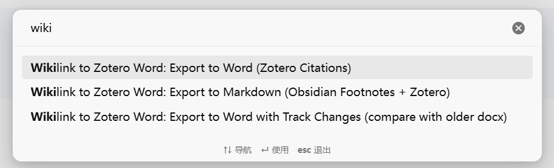
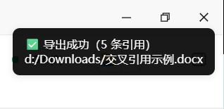
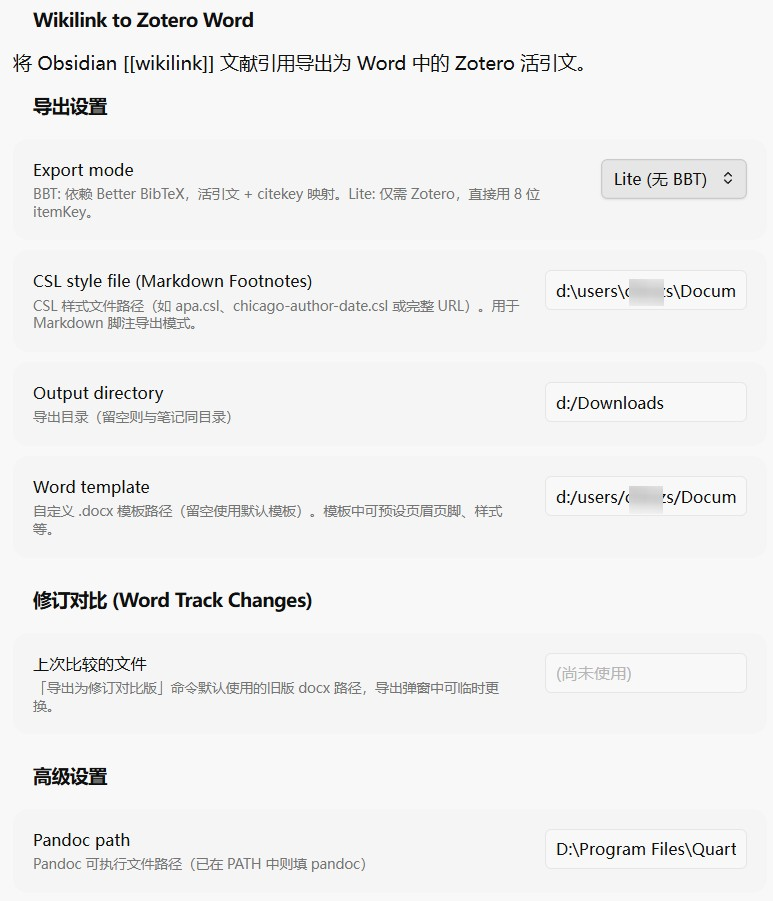
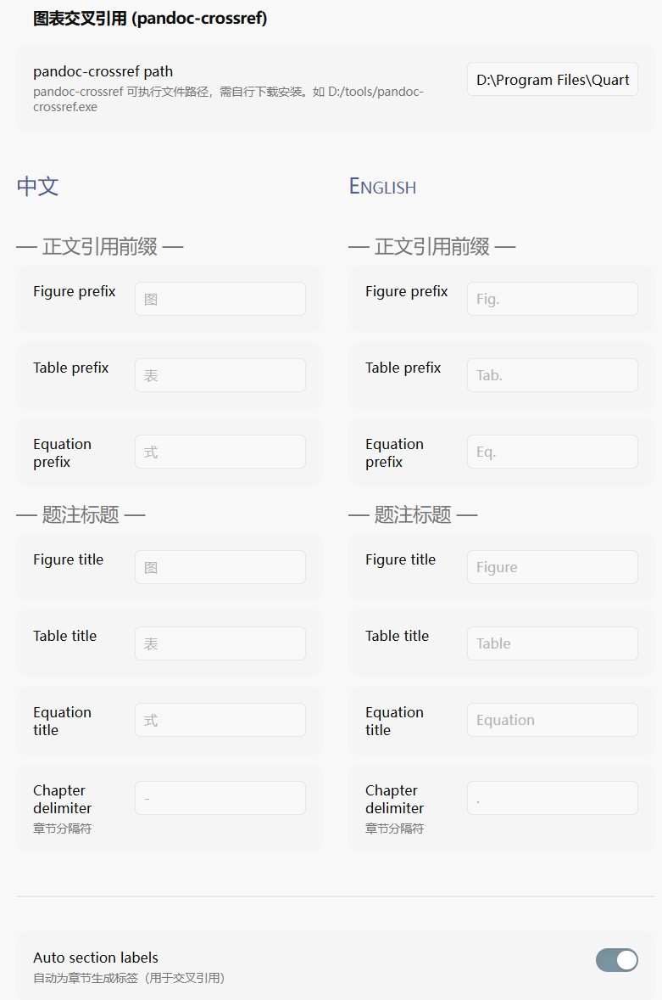
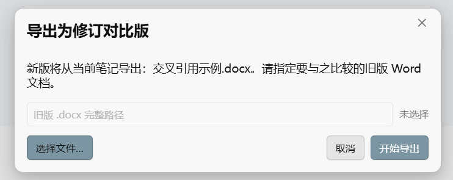
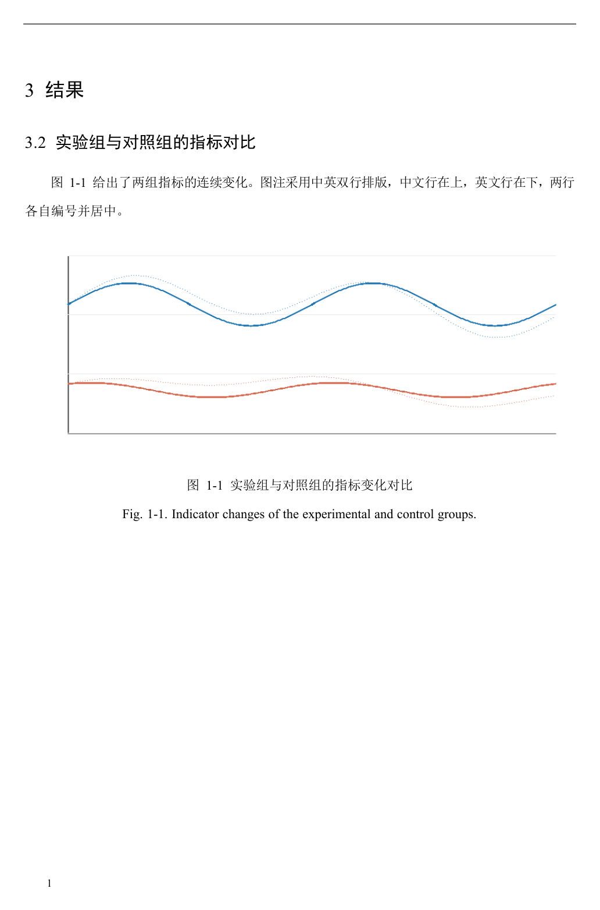

# 图文教程：从 Obsidian 双链引用到 Word 交付

> 本教程面向第一次使用 wikilink-zotword 的用户，覆盖安装、三种导出模式、修订对比与双语题注。完整功能清单见 [README](../README.md)。

## 推荐工作流：Zotero One + 本插件

 Zotero 是优秀的文献管理软件，但笔记管理与写作输出仍有不足。推荐搭配公众号**青柠学术**推出的 **[Zotero One](https://mp.weixin.qq.com/s/spXpI2IlYvft5hDnvDu5SQ)** 插件：它把 Zotero 文献笔记自动同步到 Obsidian，笔记文件名自带引用所需的 itemKey。这样"Zotero 管文献 → Obsidian 写作（双链引用 + 即时预览）→ 本插件交付 Word"全链路打通。


## 一、5 分钟上手

### 1. 安装插件

1. 从 [Releases](https://github.com/chmzs/obsidian-wikilink-zotword/releases) 下载最新版 `wikilink-zotword.zip`
2. 解压得到 `wikilink-zotword/` 文件夹，整个放入 `{vault}/.obsidian/plugins/` 下
3. 重启 Obsidian（或在 设置 → 第三方插件 中点刷新），启用 "Wikilink to Zotero Word"

### 2. 安装依赖

| 依赖 | 必需？ | 说明 |
|------|--------|------|
| [Pandoc](https://pandoc.org/installing.html) ≥ 2.16.2 | ✅ | 需在 PATH 中，或在设置中填入完整路径 |
| [Zotero](https://www.zotero.org/) | ✅ | 导出时需保持运行（端口 23119） |
| [Better BibTeX](https://retorque.re/zotero-better-bibtex/) | BBT 模式 | Zotero 插件；Lite 模式不需要 |
| [pandoc-crossref](https://github.com/lierdakil/pandoc-crossref/releases) | 可选 | 图表公式交叉引用 |

### 3. 写一条引用，导出一次

在笔记里写一条带 itemKey 的 wikilink 引用（Zotero One 同步的文献笔记文件名自带）：

```markdown
如 [[2024_Smith_Advances in method_KEY-ABC12345|Smith et al., 2024]] 所示……
```

然后 `Ctrl+P` → `Export to Word (Zotero Citations)`，导出的 `.docx` 打开后引用就是 Zotero 活引文，可在 Word 里刷新样式、跳转原文。





## 二、三种导出模式怎么选

| 模式 | 命令 | 输出 | 适合 |
|------|------|------|------|
| **BBT** | Export to Word | `.docx` 活引文 | 装了 Better BibTeX 的标准环境 |
| **Lite** | 同上 | `.docx` 活引文 | 不想装 BBT；只要 Zotero 在运行就能用 |
| **脚注** | Export to Markdown Footnotes | `.md` 作者年份脚注 | 公众号、博客等 Markdown 平台 |

**选型一句话**：能装 BBT 就装（citekey 稳定、支持 CSL 切换）；装不了用 Lite；发公众号用脚注模式。

模式切换在 插件设置 → Export mode 下拉框。





## 三、给导师看修订痕迹（v0.4.0 新增）

场景：第一版论文已发给导师，现在你在 Obsidian 里改完了，想让导师在 Word 里直接看到改了哪里。

1. 准备旧版 docx（上次发给导师的那份）
2. `Ctrl+P` → `Export to Word with Track Changes (compare with older docx)`
3. 弹窗中确认旧版路径——默认预填上次所选，直接点"开始导出"；不对就"选择文件…"重新挑
4. 插件先正常导出新版，再调用 Word 比较，生成 `{笔记名}_修订对比.docx`



产物长这样——红色删除线 + 下划线插入，都是 Word 原生修订标记，导师可以逐条接受/拒绝：


**两个关键注意点**：

- 旧版 docx 最好也由本插件导出（同一条 Pandoc 管线、同一 Word 模板）。如果旧版是手动排过版的，排版差异会淹没真正的文字修改
- 需要 Windows + 本机安装 Microsoft Word（COM 自动化），WPS 暂不支持

## 四、双语图表题注（v0.4.0 新增）

中文期刊和学位论文常要求题注中英对照。在 callout 题注里用 `|` 分隔中英文：

```markdown
> [!figure] 图 1-1 实验组与对照组指标变化 | Fig. 1-1. Indicator changes of the experimental and control groups.
> 数据说明
>
> 

> [!table] 表 1-1 两组数据对比 | Tab. 1-1. Comparison of the two groups.
>
> | 组别 | 均值 |
> |------|------|
> | 实验组 | 1.8 |
> | 对照组 | 1.0 |
```

Word 导出时，两行在同一题注段内上下排列（真实换行）。配合 Word 模板使用效果如下：



说明：

- 翻译内容需要自己来，插件只负责排版
- **Word 模式**编号按你写的保留（自己控制编号）；**脚注模式**两行自动编号（`图 N` / `Fig. N`），题注里不要再手写编号
- 英文行前缀取自设置的 English 列（默认 `Fig.` / `Tab.`）
- 单语题注不写 `|` 即可；`|` 分隔符对普通图片嵌入 `![[file|caption]]` 不生效

## 五、Word 模板

插件支持自定义 Word 模板（设置 → Word template）。仓库自带一份脱敏的中文论文模板 [docs/templates/academic-cn.dotx](templates/academic-cn.dotx)——宋体正文、黑体多级标题、页眉页码，适合中文期刊/学位论文场景。下载（或 Clone）后把完整路径填进设置即可，本教程的效果图都是用它导出的。

## 六、常见坑

1. **导出后 Word 里引用是乱码或静态文本**：Zotero 没在运行，或 BBT 引用键没配置。BBT 设置里把引用键公式改为 `auth.lower + year + '-' + item`，让 citekey 末尾带上 8 位 item key
2. **Pandoc 找不到**：PATH 里没有时，在插件设置 → Pandoc path 填完整路径
3. **修订对比结果全是格式噪音**：旧版不是插件导出的。找旧 Markdown 重新导出一份，再和新版比较
4. **交叉引用编号错乱**：脚注导出时 @fig: 标签前要有空格；自定义标签 `{#fig:xxx}` 写在题注行末尾
5. **Lite 模式引用匹配失败**：检查引用 wikilink 的文件名是否含 `KEY-XXXXXXXX`（8 位大写字母数字）

## 七、延伸

- [README](../README.md)：完整设置项与 FAQ
- [交叉引用示例](crossref-example.md)：图表 callout、公式标签完整示例
- 插件源码与 issue：<https://github.com/chmzs/obsidian-wikilink-zotword>
